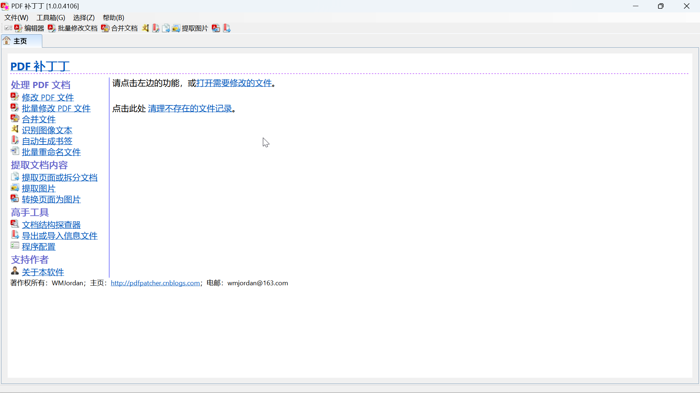
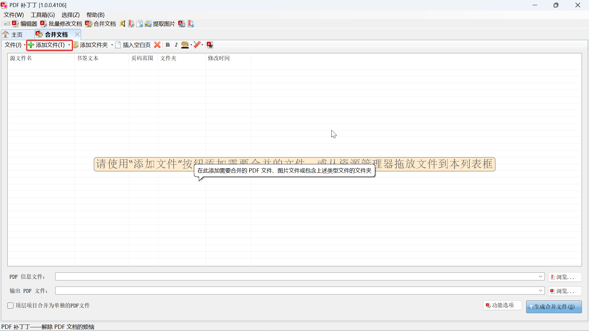
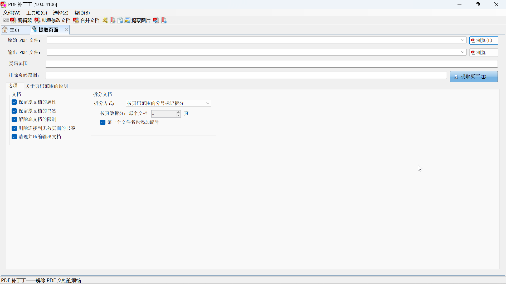
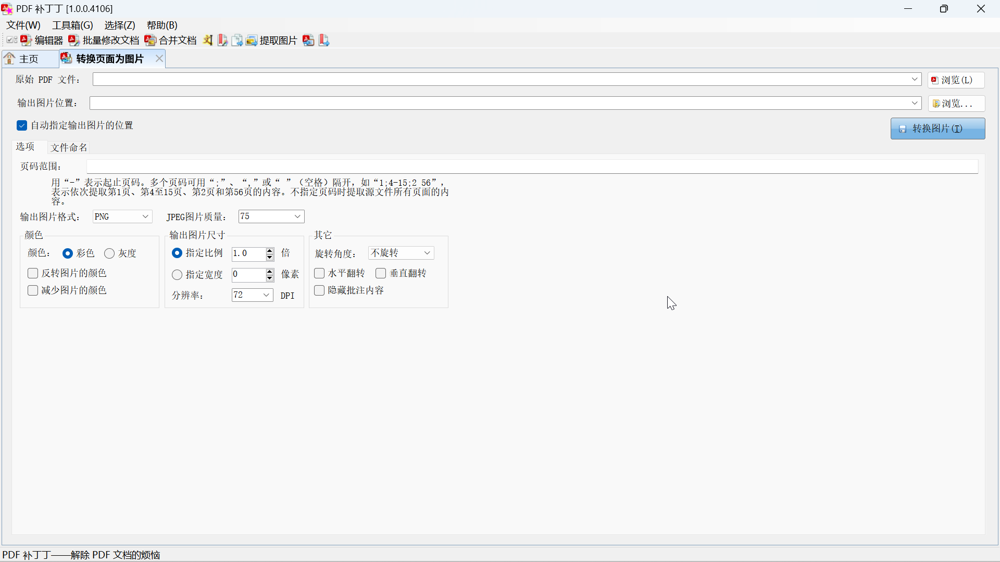

# PDF补丁丁基本使用

## 引言

日常办公中，我们经常使用pdf文件。pdf文件有许多优点：

* 支持富文本，例如图片，序列，表格，链接等；

* 可以在阅读时做注释；

* 对数学公式支持良好；

* 在不同设备间无差别呈现等。

所以我们将文件转化为pdf格式发送给对方。

pdf格式虽然具有种种优点，但是很难编辑、处理。我们很多时候需要将几张图片转化为pdf，将几个pdf合为一个，或者相反。市面上有许多针对pdf文件办公开发的软件，除了阅读及简单注释外，其余功能无一例外收费，且价格不菲。

其实，我们日常办公中对pdf文件的操作需求很简单，但是很难找到合适的软件。我在网上寻找到一个小工具-pdf补丁丁，它安全免费，能满足我们日常使用。

## PDF补丁丁

pdf补丁丁的官网是[https://www.cnblogs.com/pdfpatcher](https://www.cnblogs.com/pdfpatcher/)，页面内有下载链接，软件说明书。下载得到一个压缩文件，解压，文件夹内包含程序的主体与依赖，这些文件不能删除或移动。程序无需安装，双击PDFPatcher.exe即可运行。主页如下：

从图中可以看出PDF补丁丁有许多功能，我们主要使用下面几个。

## 图片转PDF

在主页找到“合并文件”，点击，出现如下界面：

在界面左上角找到“添加文件”（上图画红框处），点击后出现文件管理器，选择需要转化的图片。多张图片可通过多次点击“添加文件”添加，图片排列顺序决定输出顺序。然后在界面底部“输出PDF文件”后点击“浏览”（注意：不要点击“PDF信息文件”后的“浏览”），出现文件管理器，对输出的PDF文件命名。最后点击“生成合并文件”，进度条走满后转化完成。

## 合并PDF文件

方法与图片转PDF类似，点击“添加文件”后选择PDF文件，然后设置输出PDF文件名，最后点击“生成合并文件”。

## 提取PDF页面

在主页点击“提取页面或拆分文档”，出现如下页面：

在“原始PDF文件”后点击“浏览”，选择原PDF文件，然后在“输出PDF文件”后点击“浏览”，对输出文件进行命名。接着选择需要提取的PDF页码，在“页码范围”处填写页码。页码范围按照如下规则填写：

* 页码范围表示需处理的原始 PDF 文档页面。

* 不指定页码范围时，提取源文件所有页面的内容。

* 如有多个页码，可用“,”或“ ”（空格）隔开。

* 用“-”表示起止页码。例如：“1;4-15;2 56”，表示依次提取第1页、第4至15页、第2页和第56页的内容。

* 如“-”之前的数字大于“-”之后的数字，表示逆序处理。例如：“300-1”表示提取第300、299、298……3、2、1页的内容。

* 负数表示文档倒数页数，例如“-1”表示倒数第1页，“1--2”表示从第1页到倒数第2页。

* 分号“;”表示拆分成多个文件，例如“1-5;1,6-10”表示拆分成两个文件，其中第1至5页为一个文件，第1页和6到10页为第二个文件。

最后点击“提取页面”，得到输出文件。

## PDF页面转图片

在主页点击“转换页面为图片”，出现如下页面：

PDF页面转图片大体操作与前面相同，选择“原始PDF文件”后软件会自动新建一个与原始PDF文件同名的文件夹存放图片。

在设置“输出图片格式”时，可以选择常用的PNG（无损）或者JPEG（有损）；在输出图片尺寸下面可以设置分辨率，分辨率高图像存储空间大，清晰。

最后点击“转换图片”得到多张图片。

## 结语

本文介绍了如何使用PDF补丁丁简单处理PDF，可以满足日常办公。如果还想进一步了解，开发者提供的软件说明书中有进阶使用教程。
